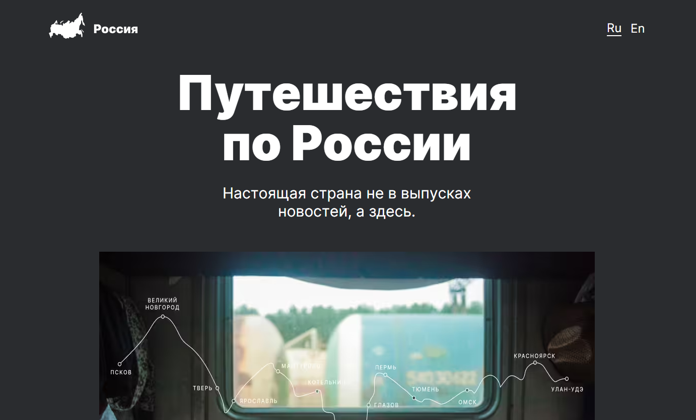

# Проект «Путешествие по России»

Проект представляет из себя лендинг, рассказывающий о путешествиях по России и интересных местах для отдыха.

## Ссылка

[Ссылка проекта на GitHub Pages](https://mtokmin.github.io/travel_in_Russia/)

## Скриншот

## Используемые технологии

- PUG
- SCSS
- Семантическая вёрстка 
- Адаптивная вёрстка (Реализована с помощью медиа-запросов; применён подход Mobile first)
- БЭМ
- GULP

## Цель проекта

Целью проекта была практика по PUG, SCSS и адаптивной вёрстке. 

## Автор

**Токмин Михаил**

telegram: [@hidrargium](https://t.me/hidrarguim)
